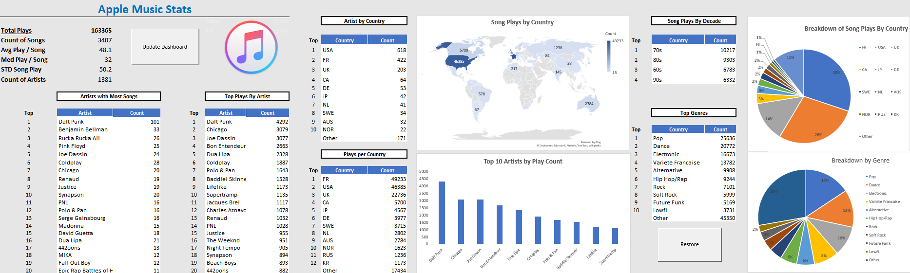

# Machine Learning to Predict Song Plays on Apple Music. 

Data Science Project which aims to predict song play count from my personal Apple Music Library. 

## Table of Contents: 
**I. Data Source**
 - [Music Statistics Exports](https://docs.google.com/spreadsheets/d/1RFQwXn4CjMaCNeCP-0PGxkYMUfQJ00FEzcYNGDzLZes/edit#gid=0) --
 Data comes from Itunes Library. Exported as a csv format and added to Google Sheets. 

**II. Workbook Organization** 
 - [Full Workbook](https://github.com/benjaminbellman/Shopify_CLTV_Machine_Learning/tree/main/Jupyter_Notebooks/4.Modelling)
    1.   _Data Exploration & Cleaning_: Exploring our data and conducting cleaning and wranglings steps.
    2.   _Exploratory Data Analysis_: Exploring the statistical relationships between our independent and dependent variables. 
    3.   _Modelling_: Creating a Regression Model which is able to predict how many times a new added song will be played. 
    
**II. Dashboard**
 - [Data Dashboard](https://github.com/benjaminbellman/Shopify_CLTV_Machine_Learning/blob/main/Jupyter_Notebooks/1.Data_Exploration/Data_Exploration.ipynb) -- Dashboard which allows to quickly structure the data and provide summary of Itunes Library. Full Data for the analysis comes from the Input_data columns once the 'Format Data' button is activated. 

## Contributing

Contributions are always welcome! 

See `contributing.md` for ways to get started.

Please adhere to this project's `code of conduct`.
